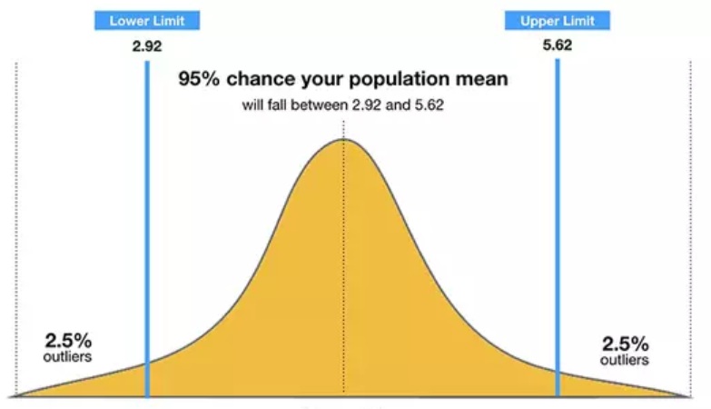

YouTube: <a href="https://www.youtube.com/watch?v=g6ddpZHTp24" target="_blank">https://www.youtube.com/watch?v=g6ddpZHTp24</a>  

```{r setup, include=FALSE}
knitr::opts_chunk$set(echo = TRUE)
```

```{r warning=FALSE, message=FALSE}
library(tidyverse)
library(knitr)
library(kableExtra)
library(matrixcalc)
```


# Problem 1  

Using R, generate a random variable X that has 10,000 random uniform numbers from 1 to N, where N can be any number of your choosing greater than or equal to 6.  Then generate a random variable Y that has 10,000 random **normal** numbers with a mean of $\mu=\sigma=\frac{N+1}{2}$

```{r}
set.seed(12345)
N <- 10
n <- 10000
mu <- sigma <- (N + 1)/2
df <- data.frame(X = runif(n, min = 1, max = N), Y = rnorm(n, mean = mu, sd = sigma))
```


```{r}
summary(df$X)
```

```{r}
summary(df$Y)
```

## Question 1  

**Probability**.   Calculate as a minimum the below probabilities a through c.  Assume the small letter "x" is estimated as the median of the X variable, and the small letter "y" is estimated as the 1st quartile of the Y variable.  Interpret the meaning of all probabilities.

```{r}
x <- quantile(df$X, 0.5)  # or use median(df$X)
x
```

```{r}
y <- quantile(df$Y, 0.25)
y
```


a. P(X>x | X>y)		

Probability of A occurring, given that B has occurred - P(A|B)

```{r}
pba_a <- df %>% filter(X > x, X > y) %>% nrow()/n
pb_a <- df %>% filter(X > y) %>% nrow()/n

Qa <- pba_a/pb_a
Qa
```

b. P(X>x, Y>y)	

```{r}
Qb = df %>% filter(X > x, Y > y) %>% nrow()/n
Qb
```

c. P(X<x | X>y)				

```{r}
pba_c = df %>% filter(X < x, X > y) %>% nrow()/n
pb_c = df %>% filter(X > y) %>% nrow()/n

Qc = pba_c/pb_c
Qc
```

## Question 2  

Investigate whether P(X>x and Y>y)=P(X>x)P(Y>y) by building a table and evaluating the marginal and joint probabilities.

```{r}
# Probability - Joint
inv = df %>% mutate(A = ifelse(X > x, " X > x", " X < x"), B = ifelse(Y > y, " Y > y", " Y < y")) %>% group_by(A, B) %>% summarise(count = n()) %>% mutate(probability = count/n)

# Probability - Marginal
inv = inv %>% ungroup() %>% group_by(A) %>% summarize(count = sum(count), probability = sum(probability)) %>% mutate(B = "Total") %>% bind_rows(inv)

inv = inv %>% ungroup() %>% group_by(B) %>% summarize(count = sum(count), probability = sum(probability)) %>% mutate(A = "Total") %>% bind_rows(inv)

# Table
inv %>% select(-count) %>% spread(A, probability) %>% rename(` ` = B) %>% kable() %>% kable_styling()
```


P(X>x and Y>y) = 0.3808  
P(X>x) P(Y>y) = 0.5 x 0.75 = 0.375

**They are not the same**

## Question 3  

Check to see if independence holds by using Fisher’s Exact Test and the Chi Square Test.  What is the difference between the two? Which is most appropriate?

```{r}
# Fisher’s Exact Test
count_data = inv %>% filter(A != "Total", B != "Total") %>% select(-probability) %>% spread(A, count) %>% as.data.frame()
row.names(count_data) = count_data$B
count_data = count_data %>% select(-B) %>% as.matrix()

fisher.test(count_data)
```

```{r}
chisq.test(count_data)
```


**Difference between Fisher's Exact test and Chi-square test**

Fisher's Exact test is a way to test the association between two categorical variables when you have small cell sizes (expected values less than 5). Chi-square test is used when the cell sizes are expected to be large.

*Chi-square test would be most appropriate*

# Problem 2  

You are to register for Kaggle.com (free) and compete in the House Prices: Advanced Regression Techniques competition.  https://www.kaggle.com/c/house-prices-advanced-regression-techniques.

```{r}
# Data Load
kdata = read.csv("https://raw.githubusercontent.com/monuchacko/cuny_msds/master/data_605/train_house.csv", header = TRUE) %>% filter(GrLivArea < 4000)

# Smooth data replace N/A's
data = function(df) {
    df %>% 
    mutate(BedroomAbvGr = replace_na(BedroomAbvGr, 0), 
           BsmtFullBath = replace_na(BsmtFullBath, 0), 
           BsmtHalfBath = replace_na(BsmtHalfBath, 0), 
           BsmtUnfSF = replace_na(BsmtUnfSF, 0), 
           EnclosedPorch = replace_na(EnclosedPorch, 0), 
           Fireplaces = replace_na(Fireplaces, 0), 
           GarageArea = replace_na(GarageArea, 0), 
           GarageCars = replace_na(GarageCars, 0), 
           HalfBath = replace_na(HalfBath, 0), 
           KitchenAbvGr = replace_na(KitchenAbvGr, 0), 
           LotFrontage = replace_na(LotFrontage, 0), 
           OpenPorchSF = replace_na(OpenPorchSF, 0), 
           PoolArea = replace_na(PoolArea, 0), 
           ScreenPorch = replace_na(ScreenPorch, 0), 
           TotRmsAbvGrd = replace_na(TotRmsAbvGrd, 0), 
           WoodDeckSF = replace_na(WoodDeckSF, 0))
}

kdata = data(kdata)
#print(kdata)
```

## Question 1  

- Descriptive and Inferential Statistics. Provide univariate descriptive statistics and appropriate plots for the training data set.  Provide a scatterplot matrix for at least two of the independent variables and the dependent variable. Derive a correlation matrix for any three quantitative variables in the dataset.  Test the hypotheses that the correlations between each pairwise set of variables is 0 and provide an 80% confidence interval.  Discuss the meaning of your analysis.  Would you be worried about familywise error? Why or why not?


#### Descriptive Statistics

Descriptive statistics provide information about the central location (central tendency), dispersion (variability or spread), and shape of the distribution.

```{r}
summary(kdata$LotArea)
hist(kdata$LotArea, xlab = "Lot Area", main = "Histogram of Lot Area", col = "#9eb4cc")
```


```{r}
summary(kdata$OverallQual)
hist(kdata$OverallQual, xlab = "Overall Quality", main = "Histogram of Overall Quality", col = "#ffc0cb")

```

```{r}
summary(kdata$SalePrice)
hist(kdata$SalePrice, xlab = "Lot Area", main = "Histogram of Sale Price", col = "#d59cff")
```

##### Scatterplot

```{r}
kdata %>%
  select(TotalBsmtSF, GrLivArea, YearBuilt, SalePrice) %>%
  pairs()
```


```{r}
# Lot Area vs. Sale Price
ggplot(kdata, aes(x = LotArea, y = SalePrice)) + geom_point() + theme(axis.text.x = element_text(angle = 60, hjust = 1))
```

```{r}
# Overall Quality vs. Sale Price
ggplot(kdata, aes(x = OverallQual, y = SalePrice)) + geom_point(aes(color = factor(OverallQual))) + 
  theme(axis.text.x = element_text(angle = 60, hjust = 1))
```


##### Correlation Matrix

A correlation matrix is simply a table which displays the correlation coefficients for different variables. The matrix depicts the correlation between all the possible pairs of values in a table. It is a powerful tool to summarize a large dataset and to identify and visualize patterns in the given data.

```{r warning=FALSE, message=FALSE}
library(corrplot)
library("PerformanceAnalytics")
```

```{r}
correlationmatrix = kdata %>% select(LotArea, OverallQual, SalePrice) %>% cor() %>% as.matrix()
correlationmatrix

corrplot(correlationmatrix, type = "upper", order = "hclust", tl.col = "black", tl.srt = 45)
chart.Correlation(correlationmatrix, histogram=TRUE, pch=19)

```

##### Test Hypothesis

Correlation test is used to evaluate the association between two or more variables.  

- *Pearson correlation* (r), which measures a linear dependence between two variables (x and y). It’s also known as a parametric correlation test because it depends to the distribution of the data. It can be used only when x and y are from normal distribution. The plot of y = f(x) is named the linear regression curve. Assumption for Pearson correlation - level of measurement, related pairs, absence of outliers, normality of variables, linearity, and homoscedasticity  

- *Kendall tau* and *Spearman rho*, which are rank-based correlation coefficients (non-parametric)

```{r}
cor.test(kdata$LotArea, kdata$SalePrice, conf.level = 0.8)
```

```{r}
cor.test(kdata$OverallQual, kdata$SalePrice, conf.level = 0.8)
```

Important numbers here are df (degrees of freedom), p-value and Pearson correlation numbers. The p-values here are greater that 0.05 and might not have strong correlation.  


## Question 2  

#### Linear Algebra and Correlation

- Linear Algebra and Correlation.  Invert your correlation matrix from above. (This is known as the precision matrix and contains variance inflation factors on the diagonal.) Multiply the correlation matrix by the precision matrix, and then multiply the precision matrix by the correlation matrix. Conduct LU decomposition on the matrix.  

##### Precision Matrix

The precision matrix of a random vector is the inverse of its covariance matrix.


```{r}
precisionmatrix = solve(correlationmatrix)
precisionmatrix
```


##### Correlation Matrix by Precision Matrix

```{r}
mult = round(correlationmatrix %*% precisionmatrix)
mult
```

##### Precision Matrix by Correlation Matrix

```{r}
mult2 = round(precisionmatrix %*% correlationmatrix)
mult2
```


##### LU Decomposition

```{r}
decomp = lu.decomposition(correlationmatrix)
decomp

correlationmatrix
```


## Question 3  

- ### Calculus-Based Probability & Statistics

Many times, it makes sense to fit a closed form distribution to data.  Select a variable in the Kaggle.com training dataset that is skewed to the right, shift it so that the minimum value is absolutely above zero if necessary.  Then load the MASS package and run fitdistr to fit an exponential probability density function.  (See  https://stat.ethz.ch/R-manual/R-devel/library/MASS/html/fitdistr.html ).  Find the optimal value of $\lambda$ for this distribution, and then take 1000 samples from this exponential distribution using this value (e.g., rexp(1000, $\lambda$)).  Plot a histogram and compare it with a histogram of your original variable.   Using the exponential pdf, find the 5th and 95th percentiles using the cumulative distribution function (CDF).   Also generate a 95% confidence interval from the empirical data, assuming normality.  Finally, provide the empirical 5th percentile and 95th percentile of the data.  Discuss.

#### Variable Skewed To The Right

```{r}
rs = min(kdata$GrLivArea)
rs
```

#### Fit Exponential Probability

Maximum-likelihood Fitting of Univariate Distributions: The goal is to find the optimal way to fit a distribution to a data. Some example of distribution are normal, exponential, gamma etc.

```{r warning=FALSE, message=FALSE}
library(MASS)
```

```{r}
epb = fitdistr(kdata$GrLivArea, "exponential")
epb
```


#### Optimal Value


```{r}
lambda = epb$estimate
lambda

opval = rexp(1000, lambda)
#opval
```

#### Histogram


```{r}
par(mfrow = c(1, 2))
hist(opval, breaks = 50, xlim = c(0, 6000), main = "Exponential - GrLivArea", col = "#F0FFFF")
hist(kdata$GrLivArea, breaks = 50, main = "Original - GrLivArea", col = "#FFE4E1")
```

#### Percentiles


```{r}
qexp(0.05, rate = lambda)
qexp(0.95, rate = lambda)
```

#### Confidence Interval

A confidence interval (CI) is a range of values that’s likely to include a population value with a certain degree of confidence. It is often expressed a % whereby a population means lies between an upper and lower interval.



```{r warning=FALSE, message=FALSE}
library("Rmisc")
```

```{r}
# Generate 95% confidence interval assuming normality
CI(na.exclude(kdata$GrLivArea), ci = 0.95)
```

#### Empirical Percentile


```{r}
# 5th percentile of the data
quantile(kdata$GrLivArea, 0.05)

# 95th percentile of the data
quantile(kdata$GrLivArea, 0.95)
```

## Question 4  

- ### Modeling  

Build some type of multiple regression  model and submit your model to the competition board.  Provide your complete model summary and results with analysis.  Report your Kaggle.com user name and score.

#### Linear Regression

```{r}
model = kdata[, which(sapply(kdata, function(x) sum(is.na(x))) == 0)]
fit = lm(kdata$SalePrice ~ kdata$OverallQual + kdata$GrLivArea + kdata$GarageCars + 
           kdata$GarageArea, data = kdata)
summary(fit)
```

#### Multiple Linear Regression

```{r}
par(mfrow = c(2, 2))
X1 = kdata$OverallQual
X2 = kdata$GrLivArea
X3 = kdata$GarageCars
X4 = kdata$GarageArea
Y = kdata$SalePrice

plot(X1, Y, col = "#c2bfbc", main = "OverallQual", ylab = "Sale Price")
abline(lm(Y ~ X1), col = "#f25d9c", lwd = 3)

plot(X2, Y, col = "#c6e2ff", main = "GrLivArea", ylab = "Sale Price")
abline(lm(Y ~ X2), col = "#c2bfbc", lwd = 3)

plot(X3, Y, col = "#aa4371", main = "GarageCars", ylab = "Sale Price")
abline(lm(Y ~ X3), col = "#c2bfbc", lwd = 3)

plot(X4, Y, col = "#37004d", main = "GarageArea", ylab = "Sale Price")
abline(lm(Y ~ X4), col = "#c6e2ff", lwd = 3)
```

```{r}
kdatatest = read.csv("https://raw.githubusercontent.com/monuchacko/cuny_msds/master/data_605/test_house.csv", header = TRUE) %>% filter(GrLivArea < 4000)

data = function(df) {
    df %>% # Replace N/A's
    mutate(BedroomAbvGr = replace_na(BedroomAbvGr, 0), 
           BsmtFullBath = replace_na(BsmtFullBath, 0), 
           BsmtHalfBath = replace_na(BsmtHalfBath, 0), 
           BsmtUnfSF = replace_na(BsmtUnfSF, 0), 
           EnclosedPorch = replace_na(EnclosedPorch, 0), 
           Fireplaces = replace_na(Fireplaces, 0), 
           GarageArea = replace_na(GarageArea, 0), 
           GarageCars = replace_na(GarageCars, 0), 
           HalfBath = replace_na(HalfBath, 0), 
           KitchenAbvGr = replace_na(KitchenAbvGr, 0), 
           LotFrontage = replace_na(LotFrontage, 0), 
           OpenPorchSF = replace_na(OpenPorchSF, 0), 
           PoolArea = replace_na(PoolArea, 0), 
           ScreenPorch = replace_na(ScreenPorch, 0), 
           TotRmsAbvGrd = replace_na(TotRmsAbvGrd, 0), 
           WoodDeckSF = replace_na(WoodDeckSF, 0))
}

#kdatatest = data(kdatatest)
#print(kdatatest)
```


```{r}
SalePrice = ((26988.854 * df$OverallQual) + (49.573 * df$GrLivArea) + (11317.522 * df$GarageCars) + (41.478 * df$GarageArea) - 98436.05)
kdatatest = kdatatest[, c("Id", "OverallQual", "GrLivArea", "GarageCars", "GarageArea")]
(head(kdatatest))
```

```{r}
ksubmission = cbind(kdatatest$Id, kdata$SalePrice)
colnames(ksubmission) = c("Id", "SalePrice")
ksubmission[ksubmission < 0] = median(SalePrice)
ksubmission = as.data.frame(ksubmission[1:1458, ])
head(ksubmission)
```

```{r}
#write.csv(ksubmission, file = "KaggleMC.csv", quote = FALSE, row.names = FALSE)
```


**Kaggle score 0.56288**  
**User: monuchacko**
