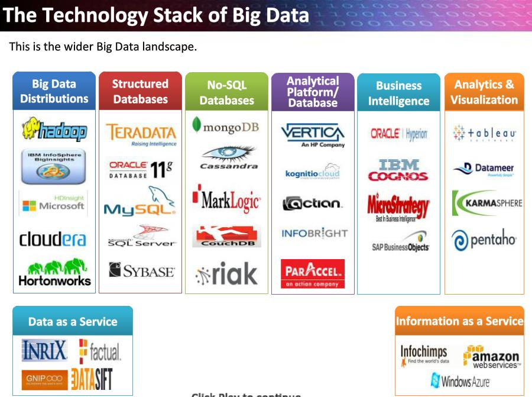

```{r setup, include=FALSE}
knitr::opts_chunk$set(echo = TRUE)
```

### Big Data - Real life issues faced by companies    


<br/><br/>

#### Introduction

There has been a great transformation in the type and scale of data we used to solve business and personal problems. Data used to be in small structured unit that needed small computation units to solve problems. These computation resources were often hosted on-premise.  

<br/><br/>

#### Problem - The Big Data Problem / Solution

Data is moving from structured to un-structured data. The means that the scope of data is now more than relational data (RDBMS). It could be unstructured data like content in word document, network etc. All these needs huge computation power at a relative low cost. Solutions like micro service has to be looked at.

- #### Insufficient understanding and acceptance of big data

Many companies lack understanding of the big data problem. To solve the problem there is a skill set required. Big data, being a huge change for a company, should be accepted by top management first and then down the ladder. To ensure big data understanding and acceptance at all levels, IT departments need to organize numerous trainings and workshops.


- #### Big Data Technology Stack

Technology Stack for big data is important. Do you need Spark or would the speeds of Hadoop MapReduce be enough? Is it better to store data in Cassandra or HBase? Finding the answers can be tricky. It depends on existing skillset. The gaps can be filled by training.



- #### Cost

Cost of hosting a large infrastructure can be huge. There are many cloud provides that uses subscription model and pay as you go statuctures. There are also hybrid solutions when parts of data are stored and processed in cloud and parts – on-premises, which can also be cost-effective. Resorting to data lakes or algorithm optimizations (if done properly) can also save money.

- #### Managing Data Quality

The data you need to analyze comes from diverse sources in a variety of different formats. For instance, ecommerce companies need to analyze data from website logs, call-centers, competitor's website 'scans' and social media. Data formats will obviously differ, and matching them can be problematic. Big data isn’t 100% accurate. And all in all, it's not that critical. But it doesn’t mean that you shouldn’t at all control how reliable your data is. Not only can it contain wrong information, but also duplicate itself, as well as contain contradictions. And it’s unlikely that data of extremely inferior quality can bring any useful insights or shiny opportunities to your precision-demanding business tasks.

- #### Data Security

Security challenges of big data are quite a vast issue. The precaution against your possible big data security challenges is putting security first. It is particularly important at the stage of designing your solution’s architecture. Because if you don’t get along with big data security from the very start, it’ll bite you when you least expect it.


- #### Analytics

Collecting analytics from large and complex dataset is challenging. Big data companies invested in analytic tools like PowerBI, Tableau to consume complex data. It also have ability to stream realtime data. 


- #### Scaling

The most typical feature of big data is its dramatic ability to grow. Ability to scale up or scale out the resource has its own challenge. Scaling can be for storage, computation etc. Right balance has to be achieved between cost and performance.  

<br/><br/>

### Conclusion  

Big data is another step to your business success. Understanding this concept and implementing will keep the business competitive.