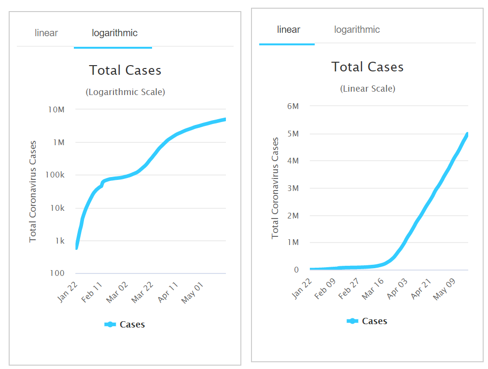

```{r setup, include=FALSE}
knitr::opts_chunk$set(echo = TRUE)
```

### Data Transformation

Data Transformation is the application of a mathematical expression to each point in the data. In contrast, in a Data Engineering context Transformation can also mean transforming data from one format to another in the Extract Transform Load (ETL) process.   


#### Importance of tranforming data  

- Interpretability

Variables could have different units. For example meter vs miles, gram vs ounce etc. To compare variables correctly it has to be in a standard form. 

- De-clutter graphs

If you visualize two or more variables that are not evenly distributed across the parameters, you end up with data points close by. For a better visualization it might be a good idea to transform the data so it is more evenly distributed across the graph. Another approach could be to use a different scale on your graph axis.

- Finding relationships between variables

The relationship between variables is often not linear but of a different type. Common example is taking the log of income to compare it to another variable as the utility of more income diminishes with higher income. Another example is the polynomial growth of money on an bank account with interest rate compared to time. To calculate a simple correlation coefficient between variables, the variables need to show a linear relationship. To meet this criteria, you might be able to transform one or both variables.

Example of same data for COVID-19 in linear and logarithmic:



- Statistical Inference

The assumption is that the data is normally distributed and not skewed left or right. For linear regression analysis an important assumption is homoscedasticity, meaning that the error variance of your dependent outcome variable is independent from your predictor variables. An assumption for many statistical test as the T-test is that the errors of a model are normally distributed.

Code Example:

```{r code, warning=FALSE}

# set seed for reproducibility
set.seed(123)

# make 100 standard normal distributed data points
x <- rnorm(100)

# calcualte density 
fit <- density(x)

library("plotly")
# plot histogram and density of data
p1<- plot_ly(x = x, type = "histogram", name = "Histogram") %>% 
            add_trace(x = fit$x, y = fit$y, type = "scatter", mode = "lines", fill = "tozeroy", yaxis = "y2", name = "Density", alpha=0.4) %>% 
            layout(yaxis2 = list(overlaying = "y", side = "right"))  %>% 
            #layout(title= "Data with Standard Normal Distribution \n µ = 0 and  σ = 1") %>% 
            hide_legend()
            


# make 100 normal distributed data points
x_2 <- rnorm(100, mean=15, sd=5.5)

# calcualte density 
fit_2 <- density(x_2)


# plot histogram and density of data
p2<- plot_ly(x = x_2, type = "histogram", name = "Histogram") %>% 
            add_trace(x = fit_2$x, y = fit_2$y, type = "scatter", mode = "lines", fill = "tozeroy", yaxis = "y2", name = "Density", alpha=0.4) %>% 
            layout(yaxis2 = list(overlaying = "y", side = "right"))  %>% 
            #layout(title= "Data with Normal Distribution \n µ = 15 and  σ = 5.5") %>% 
            hide_legend()


# put plots together into one
p<-subplot(p1, p2, shareY = TRUE)

# give each subplot a title
p %>% layout(annotations = list(
            list(x = 0.1 , y = 1.05, text = "Data with Standard Normal Distribution \n µ = 0 and  σ = 1", showarrow = F, xref='paper', yref='paper'),
            list(x = 0.85 , y = 1.05, text = "Data with Normal Distribution \n µ = 15 and  σ = 5.5", showarrow = F, xref='paper', yref='paper'))
)
            
            
# another way to put plots together            
#crosstalk::bscols(p1,p2)     
```


### Right (positive) skewed data

- Root ⁿ√x. Weakest transformation, stronger with higher order root. For negative numbers special care needs to be taken with the sign while transforming negative numbers:

- Logarithm log(x). Commonly used transformation, the strength of this transformation can be somewhat altered by the root of the logarithm. It can not be used on negative numbers or 0, here you need to shift the entire data by adding at least |min(x)|+1.

- Reciprocal 1/x. Strongest transformation, the transformation is stronger with higher exponents, e.g. 1/x³. This transformation should not be done with negative numbers and numbers close to zero, hence the data should be shifted similar as the log transform.

### Left (negative) skewed data

- Reflect Data and use the appropriate transformation for right skew. Reflect every data point by subtracting it from the maximum value. Add 1 to every data point to avoid having one or multiple 0 in your data.

- Square x². Stronger with higher power. Can not be used with negative values.

- Exponential eˣ. Strongest transformation and can be used with negative values. Stronger with higher base.

