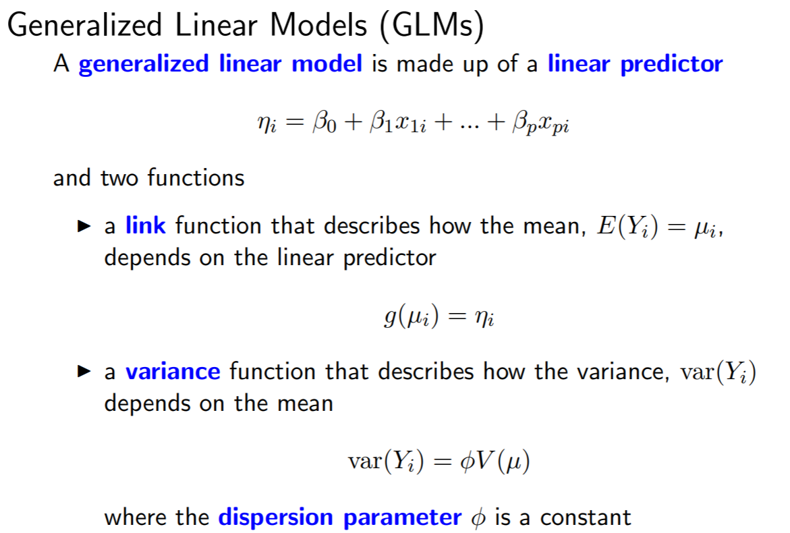

```{r setup, include=FALSE}
knitr::opts_chunk$set(echo = TRUE)
```

## Generalized, linear, and generalized least squares models (LM, GLM, GLS)


### Linear regression (LM)

Linear regression is used to predict the value of an outcome variable Y based on one or more input predictor variables X. The aim is to establish a linear relationship (a mathematical formula) between the predictor variable(s) and the response variable, so that, we can use this formula to estimate the value of the response Y, when only the predictors (Xs) values are known.


The general mathematical equation for a linear regression is

y = ax + b

- y is the response variable
- x is the predictor variable
- a and b are constants which are called the coefficients


```{r}
plot(Ozone~Wind, airquality)
model1 <- lm(Ozone~Wind, airquality)
par(mfrow = c(2, 2))
plot(model1)
coef(model1)

Oz1 <- coef(model1)[1] + coef(model1)[2] * 19
Oz2 <- coef(model1)[1] + coef(model1)[2] * 20

Oz1
Oz2
```

### Generalized Linear Models (GLM)

Generalized linear models provide a common approach to a broad range of response modeling problems. Normal, Poisson, and binomial responses are the most commonly used, but other distributions can be used as well. Apart from specifying the response, GLMs also need a link function to be set which allows further flexibility in the modeling. The GLM can be fitted using a common procedure and a mechanism for hypothesis testing is available. Diagnostics using deviance residuals provide a way to check that chosen models are adequate.

<br/><br/><hr/>

<hr/><br/><br/>

```{r}
model2 <- glm(Ozone~Wind, airquality, family = poisson)
coef(model2)

Oz1.glm <- exp(coef(model2)[1] + coef(model2)[2] * 19)
Oz2.glm <- exp(coef(model2)[1] + coef(model2)[2] * 20)

Oz2.glm / Oz1.glm

exp(coef(model2)[2])

```


### Generalized Least Squares (GLS)

The generalized least squares (GLS) estimator of the coefficients of a linear regression is a generalization of the ordinary least squares (OLS) estimator. It is used to deal with situations in which the OLS estimator is not BLUE (best linear unbiased estimator) because one of the main assumptions of the Gauss-Markov theorem, namely that of homoskedasticity and absence of serial correlation, is violated. In such situations, provided that the other assumptions of the Gauss-Markov theorem are satisfied, the GLS estimator is BLUE. 


```{r}
library(nlme)
#model3 <- gls(Ozone~Wind, airquality)

# Check for na's
summary(airquality$Ozone)

# suppress na's
model3 <- gls(Ozone~Wind, airquality, na.action = na.exclude)

head(airquality)
airquality$Date <- as.Date(paste(1973, airquality$Month, airquality$Day, sep = "-"))

library(lattice)

xyplot(Ozone~Date, airquality)

#model4 <- gls(Ozone~Wind*Date, airquality, na.action = na.exclude)
#plot(ACF(model4))

air2=subset(airquality, complete.cases(Ozone))

model5 <- gls(Ozone~Wind*Date, air2)
plot(ACF(model5, form=~Date), alpha=0.05) # alpha plots significant line

# Update correlation
model6 <- update(model5, correlation=corAR1())

library(MuMIn)

# Compare model
AICc(model5, model6)
summary(model6)
```

