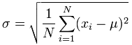

```{r setup, include=FALSE}
knitr::opts_chunk$set(echo = TRUE)
```

### Common statistical method used in Business 

- #### Mean, Median and Mode

**Mean** is calculated by taking the sum of the values and dividing with the number of values in a data series. The function mean() is used to calculate this in R.

**Median** is the middle most value in a data series is called the median. The median() function is used in R to calculate this value.

**Mode** is the value that has highest number of occurrences in a set of data. Unike mean and median, mode can have both numeric and character data. There is no built in function for mode in R. Custom function can be used.

If there are missing values, then the mean function returns NA. To drop the missing values from the calculation use na.rm = TRUE. which means remove the NA values.

```{r}
x <- c(12,7,3,4.2,18,2,54,-21,8,-5)

mean(x, trim = 0, na.rm = FALSE)

median(x, na.rm = FALSE)


funMode <- function(v) {
   uq<- unique(v)
   uq[which.max(tabulate(match(v, uq)))]
}

funMode(x)

```

#### Standard Deviation  

Standard Deviation is a measure of the amount of variation  of a set of values. A low standard deviation indicates that the values tend to be close to the mean of the set, while a high standard deviation indicates that the values are spread out over a wider range.



```{r}

x <- c(12,7,3,4.2,18,2,54,-21,8,-5)
sd(x, na.rm = FALSE)

```

#### Regression  

Regression models the relationships between dependent and explanatory variables, which are usually charted on a scatterplot. The regression line also designates whether those relationships are strong or weak. Regression is commonly taught in high school or college statistics courses with applications for science or business in determining trends over time.

```{r}
linearMod <- lm(dist ~ speed, data=cars)
summary(linearMod)
par(mfrow = c(2, 2))
plot(linearMod)
```

#### Sample Size Determination  

How many is enough? Over the years, researchers have grappled with the problem of finding the perfect sample size for statistically sound results.

The size of the sample is very important for getting accurate, statistically significant results and running your study successfully.

- If your sample is too small, you may include a disproportionate number of individuals which are outliers and anomalies. These skew the results and you don’t get a fair picture of the whole population.

- If the sample is too big, the whole study becomes complex, expensive and time-consuming to run, and although the results are more accurate, the benefits don’t outweigh the costs.


```{r}
library(e1071)

duration = faithful$eruptions
```

#### Variance

Variance is a measurement of the span of numbers in a data set. The variance measures the distance each number in the set is from the mean. Variance can help determine the risk an investor might accept when buying an investment.

```{r}
var(duration)
```

#### Skewness

The skewness of a data population is defined by the following formula, where μ2 and μ3 are the second and third central moments.

```{r}
skewness(duration)
```


#### Kurtosis

The excess kurtosis of a univariate population is defined by the following formula, where μ2 and μ4 are respectively the second and fourth central moments.

```{r}
kurtosis(duration)
```


#### Great Resource for r: http://www.r-tutor.com/elementary-statistics/probability-distributions/binomial-distribution

