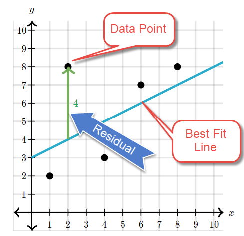
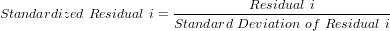

```{r setup, include=FALSE}
knitr::opts_chunk$set(echo = TRUE)
```

### Residual

Residuals are associated to a line of best fit or trend line. So what is a line of best fit or trend line? It is a straight line that best represents the data on a scatter plot. This line may pass through some of the points, none of the points, or all of the points. Residual is a measure of how well a line fits an individual data point.



The residual data of the simple linear regression model is the difference between the observed data of the dependent variable y and the fitted values ŷ.

**Residual = y - ŷ**

#### Residual Plot

```{r}
library(e1071)

duration = faithful$eruptions
```

```{r}
eruption.lm = lm(eruptions ~ waiting, data=faithful)
eruption.res = resid(eruption.lm)


plot(faithful$waiting, eruption.res, ylab="Residuals", xlab="Waiting Time", main="Old Faithful Eruptions") 
abline(0, 0) # the horizon
```


### Standardized Residual

The standardized residual is the residual divided by its standard deviation.



```{r}
eruption.lm = lm(eruptions ~ waiting, data=faithful)
eruption.stdres = rstandard(eruption.lm)

plot(faithful$waiting, eruption.stdres, ylab="Standardized Residuals", xlab="Waiting Time", main="Old Faithful Eruptions") 
abline(0, 0) # the horizon

```

### Normal Probability Plot of Residuals

The normal probability plot is a graphical tool for comparing a data set with the normal distribution. We can use it with the standardized residual of the linear regression model and see if the error term ϵ is actually normally distributed.

```{r}
eruption.lm = lm(eruptions ~ waiting, data=faithful) 
eruption.stdres = rstandard(eruption.lm)
qqnorm(eruption.stdres, ylab="Standardized Residuals", xlab="Normal Scores", main="Old Faithful Eruptions") 
qqline(eruption.stdres)
```

